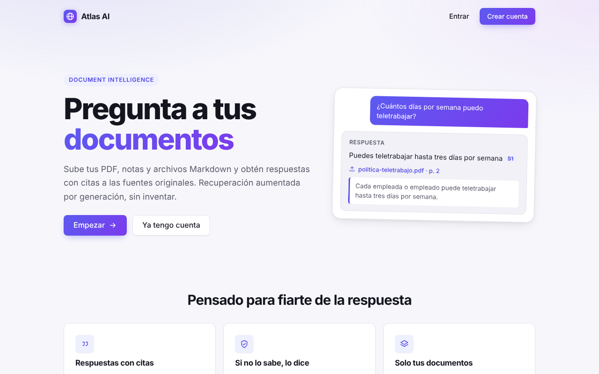
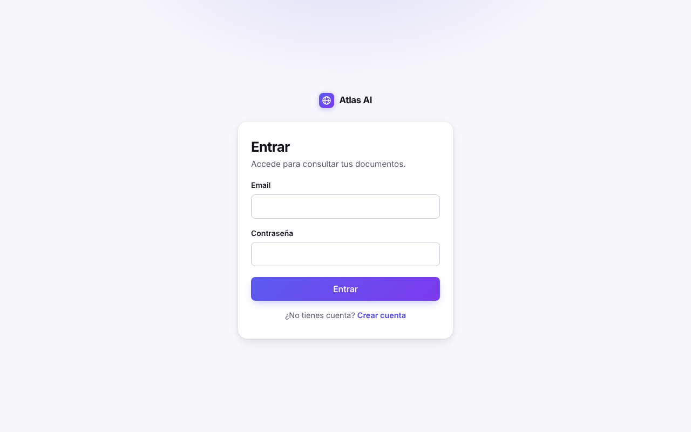
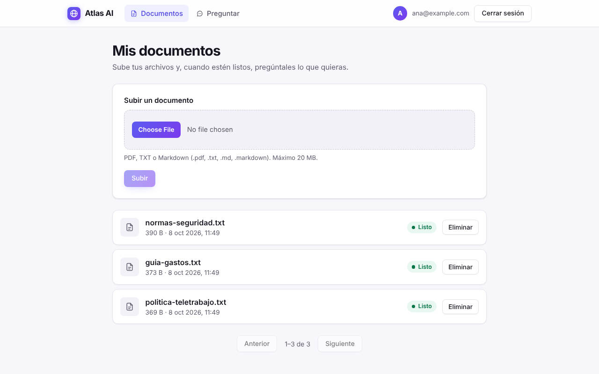
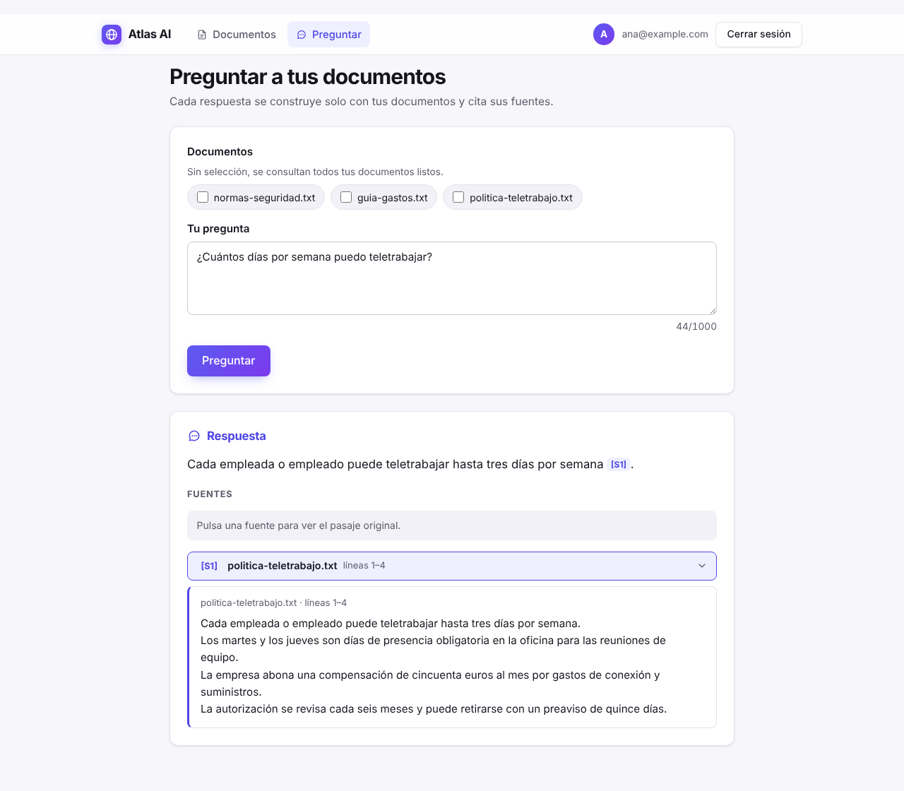
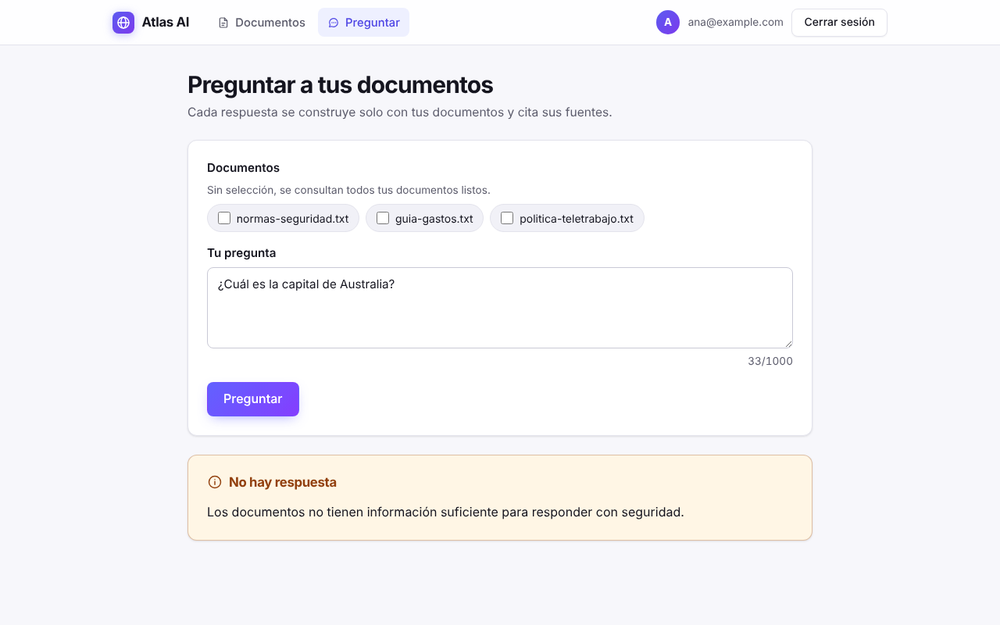
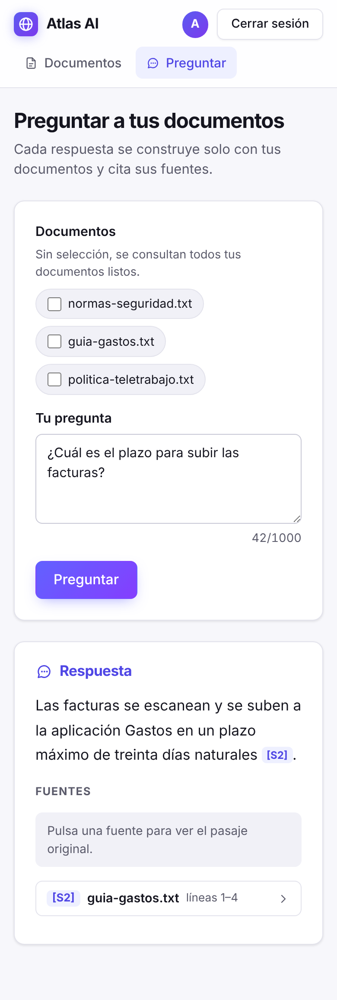
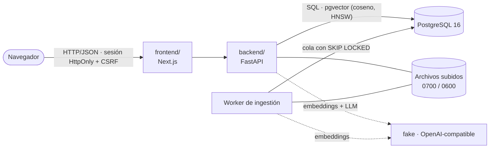

<div align="center">

# Atlas AI

**Sube tus documentos y pregúntales: cada respuesta cita el pasaje original, y si no lo sabe, lo dice.**

[](https://github.com/Cosmichomeless/Atlas-AI/actions/workflows/backend.yml)
[](https://github.com/Cosmichomeless/Atlas-AI/actions/workflows/frontend.yml)


[Probarlo](#probarlo-en-un-comando) · [Capturas](#capturas) · [Arquitectura](#arquitectura) · [Calidad](#calidad-y-evaluación) · [Documentación](#documentación)

</div>

Plataforma de **recuperación aumentada por generación (RAG)** para PDF, texto y Markdown. No es un envoltorio de un
LLM: la respuesta se construye solo con fragmentos recuperados de los documentos del usuario, se verifica que cada
cita apunta a un fragmento real y, cuando la evidencia no basta, el sistema se abstiene.

## Qué incluye

- **Respuestas con citas verificables**: cada `[S1]` abre el pasaje exacto del documento, y las citas inventadas se descartan.
- **Abstención en lugar de invención**: sin evidencia suficiente responde «No hay respuesta» y explica por qué.
- **Pipeline completo**: subida → extracción de texto (PDF, TXT, MD) → fragmentado con solape → embeddings → búsqueda por coseno con índice HNSW en pgvector → reranking léxico opcional → generación.
- **Evaluación reproducible**: dataset versionado de 32 preguntas sobre 6 documentos, métricas de recuperación y de respuesta, y una puerta de regresión de 10 umbrales que corre en cada cambio.
- **Seguridad de los datos**: aislamiento entre usuarios, sesiones en servidor con cookie `HttpOnly` y CSRF, límites de subida y de uso diario, y texto recuperado tratado como no confiable (inyección de instrucciones probada).
- **Se ejecuta en local con un comando**: Docker Compose levanta base de datos, migraciones, API, worker de ingestión y frontend; hay pruebas de humo y copias de seguridad.

## Probarlo en un comando

> **Demo pública: solo del frontend.** El frontend está publicado en Vercel
> ([atlas-ai-one-silk.vercel.app](https://atlas-ai-one-silk.vercel.app)), pero **no hay una API pública**: el
> backend, el worker y la base de datos se ejecutan en local. Sin API alcanzable se ven la portada y el acceso,
> pero no se puede iniciar sesión ni usar la aplicación. Para probarla de verdad, ejecútala en tu máquina.

Con [Docker](https://docs.docker.com/get-docker/) y Compose v2:

```bash
cp .env.example .env && docker compose up -d --build
```

Abre <http://localhost:3000>, crea una cuenta, sube un documento y pregunta. Por defecto los proveedores de IA son
`fake` (deterministas y sin red), así que **funciona sin claves**; para un modelo real define `OPENAI_API_KEY`. Para
comprobar el recorrido completo:

```bash
docker compose exec api python -m app.smoke --api-url http://localhost:8000 --origin http://localhost:3000
```

Sin Docker, o para desarrollar: [docs/development.md](docs/development.md).

## Capturas

Generadas con datos ficticios contra el sistema real (`npm run screenshots` desde `frontend/`, con el stack de los E2E
levantado; ver [frontend/README.md](frontend/README.md)).

| | |
| :-- | :-- |
| **Portada**<br> | **Acceso**<br> |
| **Documentos**<br> | **Respuesta con cita**<br> |
| **Sin respuesta**<br> | **Móvil**<br> |

## Arquitectura



- **Ingestión (asíncrona)**: la API guarda el archivo y deja el documento en cola; un worker lo extrae, lo fragmenta
  y calcula los vectores. Estados `UPLOADED → PROCESSING → READY | FAILED`, con arriendo y reintentos.
- **Recuperación y generación (por pregunta)**: se vectoriza la pregunta, se buscan los fragmentos más cercanos solo
  entre los documentos del usuario, se acota el contexto y el LLM responde únicamente con él.
- **Verificación**: las citas de la respuesta se comprueban contra los fragmentos recuperados; si ninguna es válida, se abstiene.

Detalle del flujo y de cada capa en [docs/architecture.md](docs/architecture.md).

## Decisiones de diseño

| Decisión | Por qué | Coste |
| --- | --- | --- |
| **pgvector en PostgreSQL** en vez de una base vectorial aparte | Una sola base: usuarios, documentos y vectores con transacciones y filtros por propietario | Menos escala y menos funciones que una base vectorial dedicada |
| **Abstenerse** en vez de responder siempre | Una respuesta sin evidencia es peor que ninguna | Algunas preguntas respondibles se quedan sin respuesta (8 de 32 en la evaluación con el respondedor falso) |
| **Cola de ingestión en PostgreSQL** (`FOR UPDATE SKIP LOCKED`) en vez de Redis/Celery | Sin infraestructura extra; el estado y la cola viven juntos y sobreviven a reinicios | Throughput limitado; un worker |
| **Sesiones en servidor + cookie `HttpOnly` + CSRF** en vez de JWT en el navegador | Revocables y no accesibles desde JavaScript | Estado en la base y más cuidado con CORS entre dominios |
| **Proveedores `fake` por defecto** | Tests y evaluación deterministas, sin red ni coste | Sus números no dicen nada del comportamiento con un modelo real |
| **Archivos en disco local tras una interfaz** (`FileStorage`) | Cero dependencias y permisos estrictos | Hay que compartir el volumen entre API y worker y copiarlo aparte |
| **Contrato OpenAPI versionado** y tipos generados | El frontend no duplica la lógica del API | Regenerar tipos tras cada cambio de endpoints |

## Limitaciones conocidas

- **La evaluación publicada usa modelos falsos** (embeddings por hashing y un respondedor extractivo): detecta regresiones
  del pipeline pero **no mide cuánto acierta con un modelo real ni con documentos reales**.
- **La calibración del criterio automático no es una revisión humana independiente**: la muestra de 12 preguntas la
  etiquetó Claude, viendo ya el veredicto automático. Sigue pendiente que una persona la revise.
- **Corpus pequeño y sintético**: 6 documentos, un dominio, un idioma (español), un anotador.
- **Sin OCR**: los PDF escaneados (imágenes) no se pueden leer; solo texto incrustado.
- **Sin despliegue público de la API**: el sistema se ejecuta en local; la demo de Vercel es solo el frontend.
- **Docker Compose no se ha podido ejecutar en el entorno de desarrollo**: su configuración se valida con tests de
  ficheros y los procesos se probaron fuera de Docker. Ensáyalo una vez.
- **Registro sin verificación de email ni invitaciones** (hay un interruptor para cerrarlo) y copias de seguridad sin
  cifrar; con el frontend en otro dominio, algunos navegadores bloquean las cookies entre sitios.
- Con documentos Markdown, el respondedor extractivo falso puede mostrar el título como una frase sin fuente.

El seguimiento está en las [issues](https://github.com/Cosmichomeless/Atlas-AI/issues); no se promete nada que no esté en ellas.

## Calidad y evaluación

- **Tests**: más de 1 100 en el backend (pytest con PostgreSQL real, sin mocks de la base) y 88 de componentes y
  recorridos en el frontend (Vitest), más 6 E2E con Playwright contra el stack real.
- **CI**: [`backend.yml`](.github/workflows/backend.yml) (ruff, mypy, pytest con pgvector y contrato OpenAPI al día) y
  [`frontend.yml`](.github/workflows/frontend.yml) (ESLint, tipos, tests, build y tipos de la API al día). **Los E2E y
  las pruebas de humo no corren en CI**: se lanzan a mano (`npm run e2e`, `python -m app.smoke`).
- **Evaluación**: con el dataset `atlas-qa@1.1.0` y los proveedores falsos, la línea base obtiene recall de recuperación
  0,81, 54 % de respuestas correctas, fidelidad 1,00 y 3 % de alucinaciones; con reranking léxico, recall 0,93 y 63 %
  de correctas. **Son cifras de un sistema de pruebas, no de un modelo real**; metodología, sesgos y cómo reproducirlas
  en [docs/evaluation.md](docs/evaluation.md).
- **Coste de inferencia**: ejecutarlo en local no cuesta nada; con OpenAI, una pregunta cuesta del orden de una milésima
  de dólar o menos (estimación con tarifas públicas, ver [docs/azure-deployment.md](docs/azure-deployment.md)), y las
  cuotas por usuario (100 preguntas y 300 000 tokens al día) acotan el gasto.

## Documentación

| Documento | Contenido |
| --- | --- |
| [docs/architecture.md](docs/architecture.md) | Capas, flujo RAG y decisiones |
| [docs/development.md](docs/development.md) | Instalación, puertos, comprobaciones de calidad, contrato de la API y configuración |
| [docs/local-deployment.md](docs/local-deployment.md) | Pila con Compose, salud de cada proceso y frontend en Vercel |
| [docs/access-and-secrets.md](docs/access-and-secrets.md) | Secretos, registro, cookies y CORS por escenario |
| [docs/backup-and-restore.md](docs/backup-and-restore.md) | Copias de seguridad, restauración y reconciliación |
| [docs/evaluation.md](docs/evaluation.md) | Metodología, resultados y límites de la evaluación |
| [docs/release-notes/v1.0.0.md](docs/release-notes/v1.0.0.md) | Notas de la versión 1.0.0 |
| [docs/azure-deployment.md](docs/azure-deployment.md) | Alternativa estudiada y descartada: Azure |
| [backend/README.md](backend/README.md) · [frontend/README.md](frontend/README.md) | Referencia de cada capa |
| [docs/project-brief.md](docs/project-brief.md) | Enunciado original del proyecto |

## Estructura

```text
backend/             API FastAPI, worker de ingestión, evaluación y migraciones (Python 3.12, uv)
  app/features/      auth · documents · questions · search · usage · health
  app/ingestion/     worker, extracción y fragmentado
  app/answers/       contexto, prompt, generación, citas y abstención
  app/evaluation/    dataset, métricas y puerta de regresión
frontend/            Next.js 16 (App Router, React 19, TypeScript) y E2E con Playwright
infra/postgres/      inicialización de la base de datos (pgvector y base de pruebas)
scripts/             copia de seguridad y restauración
docs/                documentación y capturas
docker-compose.yml   pila completa: db, migrate, api, ingestion, frontend
```

## Despliegue

- **Ejecutable en local**: pila completa con Docker Compose; sus procesos se han probado y el flujo completo
  (subir, indexar, preguntar, citar) se verifica con las pruebas de humo y los E2E.
- **Frontend en Vercel**: publicado como escaparate, sin API pública detrás ([detalle](docs/local-deployment.md)).
- **Solo documentado**: un despliegue en Azure (descartado, con su estimación de costes) y el uso del frontend de Vercel
  con la API expuesta por un túnel.

## Licencia

[MIT](LICENSE) © 2026 David Rodríguez
