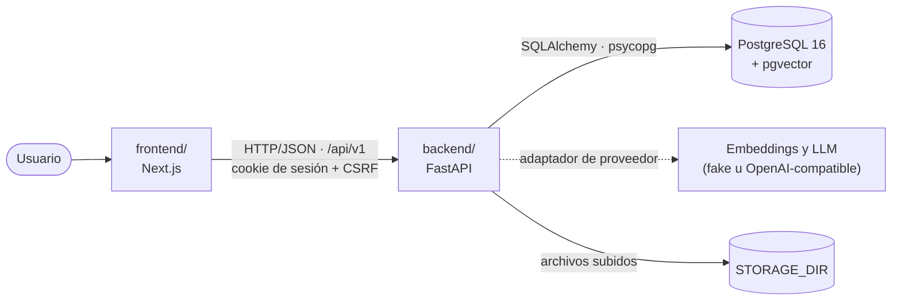
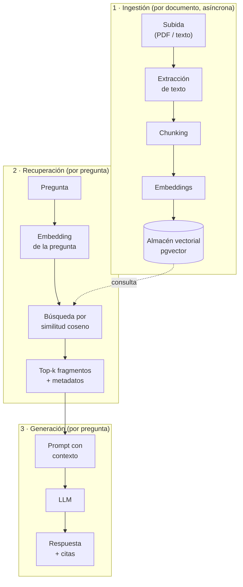

# Arquitectura

Atlas AI es un monorepo con tres capas: `frontend/` → `backend/` → PostgreSQL con pgvector.

| Capa | Responsabilidad | Tecnología |
| --- | --- | --- |
| `frontend/` | Interfaz, cliente tipado generado desde el OpenAPI del backend | Next.js, React, TypeScript |
| `backend/` | API versionada (`/api/v1`), autenticación, ingestión, recuperación y generación | FastAPI, SQLAlchemy 2, Alembic |
| PostgreSQL + pgvector | Usuarios, sesiones, documentos, fragmentos y vectores (`vector(1536)`) | `pgvector/pgvector:pg16` |

## Flujo RAG previsto

El flujo se divide en tres fases. La **ingestión** ocurre una vez por documento y de forma asíncrona;
la **recuperación** y la **generación** ocurren en cada pregunta.

### 1 · Ingestión

1. **Subida**: el usuario envía un archivo; se valida (tipo, tamaño `MAX_UPLOAD_MB`), se guarda en
   `STORAGE_DIR` y se crea un registro de documento en estado `UPLOADED`.
2. **Procesamiento asíncrono**: un worker del backend (`python -m app.ingestion.worker`) toma documentos
   pendientes con `FOR UPDATE SKIP LOCKED` y un *lease*. Estados: `UPLOADED → PROCESSING → READY | FAILED`
   (con reintento `FAILED → UPLOADED` y reindexado `READY → UPLOADED`).
3. **Extracción de texto** del PDF conservando la página de origen.
4. **Chunking**: fragmentos con solapamiento y metadatos (documento, página, posición) para poder citar.
5. **Embeddings**: cada fragmento se vectoriza mediante el adaptador de proveedor (`EMBEDDING_PROVIDER`) y
   se guarda con un índice HNSW en pgvector. `EMBEDDING_DIMENSIONS` debe coincidir con la columna.

### 2 · Recuperación

La pregunta se vectoriza con el mismo modelo y se buscan los *k* fragmentos más cercanos (similitud coseno),
filtrando siempre por los documentos del usuario autenticado.

### 3 · Generación

Los fragmentos recuperados se insertan en el prompt; el LLM (`LLM_PROVIDER`) responde **solo con ese contexto**
y la respuesta incluye citas que enlazan al documento y página originales. Si el contexto no contiene la
respuesta, el sistema debe decirlo en lugar de inventar.

## Decisiones de diseño

- **Monolito modular en el backend**: código por funcionalidad en `backend/app/features/<feature>/`;
  infraestructura común en `app/core/` y contrato HTTP en `app/api/`.
- **Contrato primero**: errores con formato único y `openapi.json` versionado; el frontend no duplica
  lógica de negocio, solo consume tipos generados.
- **Proveedores intercambiables**: `fake` (determinista, sin red) para desarrollo y tests; `openai` para
  APIs compatibles con OpenAI. Los tests nunca llaman a servicios externos.
- **Base de datos real en tests**: pytest usa PostgreSQL (`atlas_test`), no mocks, para ejercitar pgvector y
  las migraciones.
- **Migraciones con Alembic** como única vía de cambio de esquema (`uv run alembic upgrade head`).
- **Seguridad**: configuración y secretos solo por entorno; sesiones en servidor con cookie HttpOnly y
  protección CSRF (doble envío firmado + comprobación de `Origin`).

## Estado

Implementado: esqueleto del backend y frontend, PostgreSQL + pgvector, migraciones, configuración,
contrato de API y cliente tipado. El resto del flujo (acceso, documentos, ingestión, embeddings,
recuperación y generación) se construye de forma incremental según las issues del repositorio.
