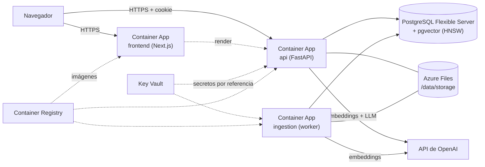

# Despliegue en Azure: servicios, costes y límites

> **Alternativa descartada.** El proyecto no se despliega en Azure: se ejecuta en local con Docker Compose y el
> frontend puede publicarse en Vercel (ver [local-deployment.md](local-deployment.md)). Este documento se conserva
> como análisis de lo que habría que hacer y cuánto costaría; nada de lo que describe está creado.

Decisión de arquitectura para publicar Atlas AI en Azure (issue #65). Es la base de las issues #66 (secretos y
HTTPS), #67 (persistencia) y #68 (despliegue). **No hay nada desplegado**: este documento decide y
estima; las cifras de dinero son órdenes de magnitud para presupuestar, no una factura.

> **Léelo antes de citar un precio.** Los importes dependen de la región, la fecha y el uso. Los marcados con
> «~» son estimaciones a partir de tarifas públicas consultadas al escribir esto; confírmalos en la
> [calculadora de Azure](https://azure.microsoft.com/pricing/calculator/) antes de comprometer presupuesto.

## Resumen de la decisión

| Pieza | Servicio elegido | Por qué |
| --- | --- | --- |
| Frontend (Next.js standalone) | Azure Container Apps | Ya hay imagen Docker; sin servidor de VM que mantener |
| API (FastAPI) | Azure Container Apps | Misma imagen que en local; HTTPS y dominio propio gestionados |
| Ingestión (worker) | Azure Container Apps, sin ingreso, 1 réplica fija | Proceso de larga duración que sondea la base de datos |
| PostgreSQL + pgvector | Azure Database for PostgreSQL – Flexible Server | Admite la extensión `vector` y los índices HNSW que usan las migraciones |
| Archivos subidos | Azure Files (recurso compartido SMB, LRS) montado en `/data` | API y worker comparten el directorio **sin cambiar código** |
| Secretos | Azure Key Vault + identidad administrada | Nada de secretos en Git ni en imágenes |
| Imágenes | Azure Container Registry (Basic) | Las tres imágenes salen del CI |
| Logs y métricas | Log Analytics (el que viene con Container Apps) | Detección de procesos caídos |
| Proveedor de IA | API de OpenAI (embeddings `text-embedding-3-small`, LLM `gpt-4o-mini`) | Es lo que ya soporta el código; ver [alternativas](#proveedor-de-ia) |

Región recomendada: una de la UE (p. ej. West Europe) para base de datos, archivos y aplicaciones, juntas para
evitar latencia y tráfico entre regiones.

## Arquitectura

- **Un solo entorno de Container Apps** con tres aplicaciones. Frontend y API tienen ingreso externo HTTPS
  (certificado gestionado, dominio propio); el worker no tiene ingreso.
- **La base de datos no es pública**: se accede por red virtual / punto de conexión privado, o como mínimo con
  reglas de firewall limitadas al entorno. Decisión final en #67.
- **El archivo original no se expone por HTTP**: la API lo escribe al subir y lo lee el worker para extraer el
  texto; las citas (`GET /documents/{id}/chunks/{chunk_id}`) se sirven desde el texto de los fragmentos guardado
  en PostgreSQL, tras comprobar el propietario. Por eso perder un archivo no rompe las citas ya indexadas, solo
  impide reprocesar ese documento.
- Dominios sugeridos bajo el **mismo sitio** (`app.ejemplo.com` y `api.ejemplo.com`), de modo que las cookies
  `SameSite=lax` siguen funcionando y `FRONTEND_ORIGIN` es el dominio del frontend. Se concreta en #66.

## Restricciones del código que condicionan la elección

Estas salen de leer el repositorio, no de preferencias:

1. **Los archivos viven en un directorio local** (`STORAGE_DIR`, `LocalFileStorage`), y **API y worker deben ver
   el mismo**. Por eso hace falta un volumen compartido (Azure Files). Con réplicas de API > 1 también sirve, al ser
   un recurso compartido de red.
2. **El worker no escucha en ningún puerto.** Su salud es un archivo de latido
   (`python -m app.ingestion.heartbeat`). Azure Container Apps **solo admite sondas HTTP o TCP, no `exec`**
   ([documentación](https://learn.microsoft.com/azure/container-apps/health-probes)), así que ese health check de
   la imagen no sirve en Azure tal cual. Sin sonda, la plataforma solo reinicia el worker si el proceso termina;
   uno colgado pasaría desapercibido. **Trabajo pendiente para #68**: exponer un endpoint HTTP mínimo en el worker
   (que devuelva 200 mientras el latido sea reciente) o añadir una alerta sobre el latido.
3. **`NEXT_PUBLIC_API_BASE_URL` se fija al construir** la imagen del frontend. Hay una imagen por entorno (o se
   construye en el pipeline de despliegue con el dominio final); no se puede cambiar solo con variables.
4. **Dimensión del embedding 1536** (columna `vector(1536)` e índices HNSW, creados por la migración 0007):
   cualquier modelo de embeddings alternativo debe producir 1536 dimensiones o requiere migración y reindexar.
   pgvector solo indexa hasta 2 000 dimensiones.
5. **En producción** la API exige `SECRET_KEY` de ≥ 32 caracteres y cookies `Secure` (HTTPS).

## Proveedor de IA

- **Recomendado para el primer despliegue: API de OpenAI directa.** El código ya la soporta
  (`EMBEDDING_PROVIDER=openai`, `LLM_PROVIDER=openai`, `OPENAI_API_KEY`) y es el único camino verificado. Los textos
  de los documentos del usuario se envían a un tercero fuera de Azure: hay que decirlo en la política de privacidad.
- **Alternativa: Azure OpenAI** mantiene los datos dentro de Azure. `OPENAI_BASE_URL` permite apuntar a otro
  endpoint compatible, pero **no está verificado** que el cliente actual (cabecera de autenticación, rutas y
  nombres de despliegue) funcione contra Azure OpenAI sin cambios. Antes de elegirlo habría que probarlo y, si
  falla, escribir un adaptador pequeño. No se decide ahora porque no hay credenciales con las que comprobarlo.
- El resultado de la [evaluación](evaluation.md) se midió con proveedores `fake`: **antes de abrir al público hay
  que repetirla con el proveedor real** (issue #69 la incluye tras el despliegue).

## Costes estimados

Supuestos: uso bajo (demo / portfolio, pocas decenas de usuarios), región de la UE, un mes de 730 horas, tarifas
de Container Apps en plan de consumo (`~0,000024 $/vCPU·s` activo, `~0,000003 $/vCPU·s` en reposo, `~0,000003
$/GiB·s`; con una cuota gratuita mensual de 180 000 vCPU·s, 360 000 GiB·s y 2 M de peticiones **por suscripción**,
según la [página de precios](https://azure.microsoft.com/pricing/details/container-apps/)).

### Infraestructura fija (al mes, aproximado)

| Concepto | Dimensionado | Coste ~ |
| --- | --- | --- |
| Container Apps: API | 0,5 vCPU / 1 GiB, 1 réplica mínima | 12–40 $ |
| Container Apps: worker | 0,5 vCPU / 1 GiB, 1 réplica fija | 12–40 $ |
| Container Apps: frontend | 0,25 vCPU / 0,5 GiB, 1 réplica mínima | 6–20 $ |
| PostgreSQL Flexible Server | Burstable B1ms–B2s, 32 GiB, backups incluidos hasta el tamaño del almacenamiento | 20–45 $ |
| Azure Files (LRS, estándar) | 10–50 GiB de PDFs | 1–5 $ |
| Container Registry | Basic | ~5 $ |
| Key Vault | Unos pocos secretos | < 1 $ |
| Log Analytics | Hasta 5 GB/mes gratuitos; después ~2–3 $/GB | 0–5 $ |
| **Total fijo** | | **~55–160 $/mes** |

Los extremos bajos suponen que las réplicas pasan casi todo el tiempo en reposo (tarifa de reposo) y el alto,
que están siempre activas. El worker consulta la base de datos cada `INGESTION_POLL_SECONDS` (2 s): su consumo
de CPU es bajo pero no cero. **Para reducir el coste** la API y el frontend pueden escalar a cero réplicas
(la primera petición tarda unos segundos más); el worker no debe escalar a cero porque nadie lo despertaría
para procesar documentos subidos.

### Coste variable de IA (por uso)

Con tarifas públicas de OpenAI al escribir esto (`gpt-4o-mini` ~0,15 $ / 1 M tokens de entrada y ~0,60 $ / 1 M de
salida; `text-embedding-3-small` ~0,02 $ / 1 M tokens):

| Operación | Cota por unidad |
| --- | --- |
| Pregunta (contexto máx. 3 000 tokens + pregunta, hasta 512 tokens de salida) | ≤ ~0,001 $ |
| Indexar un documento del tamaño máximo (5 M de caracteres ≈ 1,25 M tokens de embedding) | ≤ ~0,03 $ |
| Indexar un PDF típico de 100 páginas (~300 000 caracteres) | < 0,002 $ |

**El gasto por usuario tiene techo**: `USAGE_DAILY_QUESTIONS=100` y `USAGE_DAILY_TOKENS=300000` por usuario y día
UTC. En el peor caso un usuario cuesta del orden de unos céntimos al día; 100 usuarios al límite, del orden de
varios dólares al día. Para acotar el total: hoy el registro es abierto y **no existe un interruptor para cerrarlo**
(`POST /auth/register`), así que #66 debe decidir entre añadir uno (indicador de configuración o invitaciones) o
apoyarse solo en las cuotas por usuario, y en todo caso configurar una **alerta de presupuesto** en OpenAI y en
Azure Cost Management.

## Límites

### Límites de la aplicación (configurables por entorno)

| Límite | Valor por defecto | Variable |
| --- | --- | --- |
| Tamaño de archivo | 20 MB | `MAX_UPLOAD_MB` |
| Páginas por documento | 500 | `EXTRACTION_MAX_PAGES` |
| Caracteres extraídos | 5 000 000 | `EXTRACTION_MAX_CHARS` |
| Tiempo de extracción | 60 s | `EXTRACTION_TIMEOUT_SECONDS` |
| Preguntas / tokens al día por usuario | 100 / 300 000 | `USAGE_DAILY_QUESTIONS`, `USAGE_DAILY_TOKENS` |
| Documentos por búsqueda | 50 | `SEARCH_MAX_DOCUMENTS` |

### Capacidad de datos

Un fragmento de 1 000 caracteres almacena un vector de 1 536 `float4` (~6 KB) más su índice HNSW y el texto:
del orden de **10–15 KB por fragmento**. Un PDF típico (~350 fragmentos) ocupa unos 4–5 MB en la base de datos,
y uno del tamaño máximo (~6 000 fragmentos) unos 60–90 MB. Con 32 GiB caben miles de documentos típicos. En
una B1ms (2 GiB de RAM) el índice HNSW deja de caber en memoria con corpus grandes y las búsquedas se
ralentizan: es el primer síntoma para subir a B2s o superior.

### Límites de la plataforma a comprobar en #68

- **Tiempo máximo de una petición HTTP** en el ingreso de Container Apps (la pregunta incluye una llamada al LLM
  de hasta `LLM_TIMEOUT_SECONDS=60`): confirmar que el plazo del ingreso lo cubre con margen.
- **Tamaño máximo de petición** en la subida de 20 MB.
- **Montaje SMB**: Azure Files no admite enlaces simbólicos ni los permisos POSIX 0600/0700 que el código aplica.
  Hay que montar el recurso con `uid`/`gid` del usuario del contenedor (10001) y modos de archivo/directorio
  equivalentes, y comprobar en #67 que subir, leer y borrar funcionan. Si no, la salida es un backend de Blob
  (ver más abajo).

## Alternativa descartada y vía de salida para los archivos

- **Azure Blob Storage** sería el destino natural a largo plazo (contenedor privado, borrado lógico, versiones,
  reglas de ciclo de vida). El código ya aísla el almacenamiento tras un protocolo (`FileStorage`), así que añadir
  un backend de Blob es acotado: un módulo, sus tests y una dependencia. **No se hace ahora** porque Azure Files
  evita cambiar código para el primer despliegue; se reevalúa si el montaje SMB da problemas o los costes de
  transacciones crecen.
- **App Service / máquinas virtuales**: más trabajo operativo (parches, escalado) sin ventaja clara para esta
  carga.
- **Cosmos DB / Azure AI Search como almacén vectorial**: exigiría reescribir recuperación y migraciones; el
  proyecto está construido y evaluado sobre pgvector.

## Copia y restauración de datos

Hay dos almacenes que deben restaurarse **a un punto coherente**: la base de datos guarda las referencias
(claves) de los archivos y los archivos viven en Azure Files.

| Dato | Mecanismo | Retención | Objetivo (a validar en #67) |
| --- | --- | --- | --- |
| PostgreSQL | Copias automáticas y restauración a un punto en el tiempo (PITR) del servidor flexible | 14 días (configurable de 7 a 35) | Pérdida máx. ~5 min |
| Archivos | Instantáneas diarias del recurso compartido (Azure Backup o `az storage share snapshot`) | 14 días | Pérdida máx. 24 h |
| Copia lógica independiente | `pg_dump` semanal a una cuenta de almacenamiento aparte con borrado lógico | 8 semanas | Protege ante borrado del servidor |

**Restauración (procedimiento a ensayar):**

1. Parar el worker (réplicas = 0) y poner la API en modo mantenimiento o réplicas = 0.
2. Restaurar el servidor PostgreSQL a un **servidor nuevo** en el instante deseado (PITR) y comprobar `SELECT
   count(*)` en `documents` y `chunk_embeddings`.
3. Restaurar el recurso compartido desde la instantánea más cercana a ese instante a un recurso nuevo.
4. **Reconciliar**: los documentos cuyo original no exista en los archivos restaurados siguen siendo consultables
   (fragmentos y vectores están en la base de datos) pero no se podrán reprocesar; hay que listarlos. Los archivos
   sin fila pueden eliminarse. Hoy no hay un script de reconciliación: se crea en #67 y se ensaya.
5. Apuntar `DATABASE_URL` y el montaje de `/data` a los recursos restaurados, aplicar `alembic upgrade head`
   (idempotente) y reanudar API y worker. Los documentos que estuvieran en `PROCESSING` vuelven a la cola cuando
   vence su arriendo (`INGESTION_LEASE_SECONDS`).
6. Verificar con la prueba de humo (#69): subir, indexar, preguntar y abrir una cita.

**Ensayo obligatorio:** una copia que nunca se ha restaurado no es una copia. #67 debe incluir al menos un
ensayo de restauración con el tiempo medido, y las cifras de la tabla anterior deben ajustarse a lo medido.

**Retención de datos de usuario:** al borrar un documento se eliminan sus fragmentos y su archivo
(`features/documents/deletion.py`), pero **seguirá existiendo en las copias** hasta que caduquen (14 días). La
política de privacidad debe decirlo.

## Qué queda para las siguientes issues

| Issue | Decisiones y trabajo que salen de este documento |
| --- | --- |
| #66 | Key Vault + identidad administrada; dominios y certificados; `COOKIE_*` y `FRONTEND_ORIGIN` con los dominios finales; alertas de presupuesto; decidir cómo limitar el registro |
| #67 | Crear el servidor (allowlist de `vector`, `CREATE EXTENSION vector`, migraciones, comprobar el índice HNSW), recurso Azure Files con opciones de montaje, política de copias y ensayo de restauración, script de reconciliación |
| #68 | Sonda HTTP para el worker, imágenes por entorno (`NEXT_PUBLIC_API_BASE_URL`), plazos del ingreso, despliegue desde el CI |
| #69 | Prueba de humo tras el despliegue y evaluación con el proveedor real |

## Fuentes

- [Precios de Azure Container Apps](https://azure.microsoft.com/pricing/details/container-apps/)
- [Sondas de salud en Azure Container Apps](https://learn.microsoft.com/azure/container-apps/health-probes)
- [pgvector en Azure Database for PostgreSQL – Flexible Server](https://learn.microsoft.com/azure/postgresql/extensions/how-to-use-pgvector)
